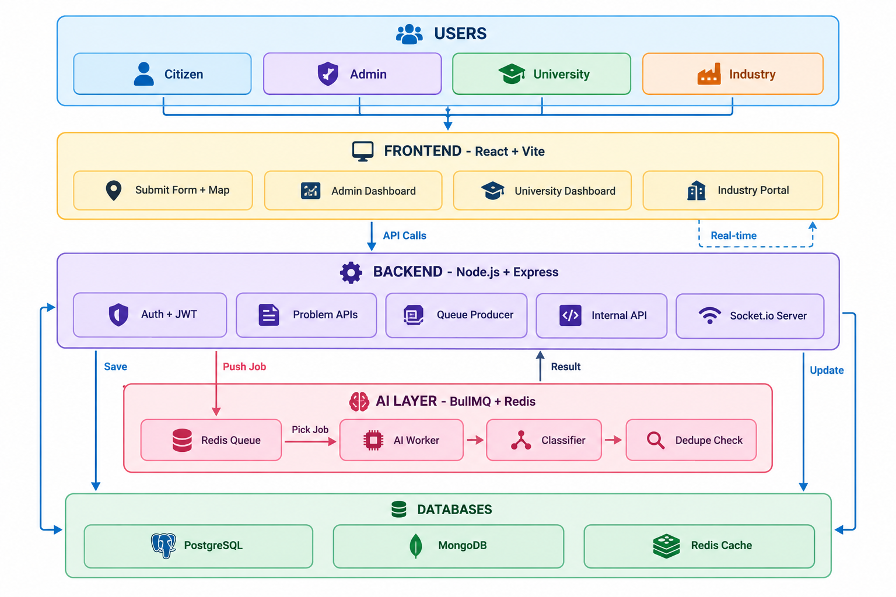

---

# 🚀 SIH 2026 - Societal Innovation Portal

## Complete Team Guide (Easy English)

---

## 📖 1. What Are We Building? (Problem Statement in Easy Words)

### The Problem:
People in Jharkhand face many problems every day:
- Dirty water in villages
- Broken roads
- Bad schools
- No hospitals nearby
- Many other small and big problems

**But there is no system where people can tell their problems to someone who can solve them.**

### The Solution:
We are building a **website + mobile app** where:

1. **Citizens** can submit their problems (with photos and location)
2. **AI** reads the problem and decides what category it belongs to
3. **Admin** assigns the problem to the right university
4. **University** forms a student team and creates a solution
5. **Industry** funds the solution
6. **Citizen** sees their problem get solved!

---

## 🎯 2. Overall Project Work (What We Need to Build)

### The 3 Main Parts of Our Project:

```
┌─────────────────────────────────────────────────────────┐
│                    OUR COMPLETE SYSTEM                   │
├─────────────────────────────────────────────────────────┤
│                                                         │
│  ┌──────────────┐  ┌──────────────┐  ┌──────────────┐  │
│  │   FRONTEND   │  │   BACKEND    │  │   AI BRAIN   │  │
│  │              │  │              │  │              │  │
│  │ • Website    │  │ • APIs       │  │ • Reads text │  │
│  │ • Mobile App │  │ • Database   │  │ • Finds      │  │
│  │ • Maps       │  │ • Queue      │  │   category   │  │
│  │ • Dashboards │  │ • Auth       │  │ • Checks     │  │
│  │              │  │ • Real-time  │  │   duplicates │  │
│  └──────────────┘  └──────────────┘  └──────────────┘  │
│         │                  │                  │         │
│         └──────────────────┴──────────────────┘         │
│                          │                              │
│                          ▼                              │
│              ✅ PROBLEM GETS SOLVED!                    │
└─────────────────────────────────────────────────────────┘
```

### What Each Part Does:

| Part | Who Uses It | What It Does |
| :--- | :--- | :--- |
| **Frontend** | Citizens, Admins, Universities, Industries | Shows pages, forms, maps. Users interact here. |
| **Backend** | System (behind the scenes) | Saves data, handles logins, sends notifications, manages the queue. |
| **AI** | System (behind the scenes) | Reads problem text, finds category, checks if problem already exists. |

---

## 🔄 3. Development Order (Who Works When?)

**We will build in this order:**

```
Phase 1: BACKEND
    ↓
Phase 2: AI INTEGRATION
    ↓
Phase 3: FRONTEND
```

### Why This Order?

| Phase | Why First? |
| :--- | :--- |
| **Backend First** | Creates the "rules" (APIs) for everyone. Frontend and AI both follow these rules. |
| **AI Second** | Backend is ready, so AI can connect easily and send results back. |
| **Frontend Last** | By now, all APIs are fixed. Frontend just needs to show the UI. No API changes later. |

---

## 🧑‍💻 4. Phase 1: BACKEND DEVELOPER'S ROLE

### Backend Developer (Person B):

**What You Need to Build:**

| Task | What It Means | Why It's Important |
| :--- | :--- | :--- |
| **User Login/Register** | People can sign up and log in | Without this, we don't know who is using the system |
| **Problem Submit API** | Save citizen's problem in database | This is the core of our system |
| **Queue System** | Put problems in a "waiting line" for AI | So users don't wait for AI to finish |
| **Internal API** | A secret API just for AI to update results | AI sends results back through this |
| **Assignment API** | Admin can assign problems to universities | This connects citizens to solutions |
| **Socket.io** | Send real-time updates | Users see changes instantly without refreshing |

### Tech Stack for Backend:

| Technology | Why We Use It | Alternative |
| :--- | :--- | :--- |
| **Node.js + Express** | Fast, easy, same language as frontend | Python (Django/Flask) |
| **TypeScript** | Catches errors before running | JavaScript |
| **PostgreSQL** | Good for relationships (users ↔ problems) | MySQL |
| **MongoDB** | Good for messy raw data | No alternative needed |
| **Redis** | Fast memory for queue and cache | No alternative |
| **BullMQ** | Smart queue manager (uses Redis) | RabbitMQ |
| **JWT** | Secure user authentication | Sessions |
| **Socket.io** | Real-time communication | WebSockets |

### Why Node.js Over Python?

- Frontend is also JavaScript, so you share code
- Faster development (one language)
- Great for real-time apps (Socket.io)

### Backend Flow (Simple):

```
[Frontend] → [Backend API] → [Save Database]
                     ↓
                [Queue] → [AI Worker]
                     ↓
            [AI sends result back]
                     ↓
            [Backend updates database]
                     ↓
            [Socket.io sends update to Frontend]
```

---

## 🤖 5. Phase 2: AI DEVELOPER'S ROLE

### AI Developer (Person C):

**What You Need to Build:**

| Task | What It Means | Why It's Important |
| :--- | :--- | :--- |
| **BullMQ Worker** | Listen to queue and pick up jobs | This is how AI gets problems to analyze |
| **Classifier** | Read text and find category | "Water", "Road", "Health", etc. |
| **Priority Scorer** | Find if problem is urgent | "HIGH" if words like "emergency" appear |
| **Dedupe Check** | Check if same problem already exists | Avoid duplicate work |
| **Internal API Call** | Send results back to Backend | Updates the problem status |

### Tech Stack for AI:

| Technology | Why We Use It | Alternative |
| :--- | :--- | :--- |
| **Node.js + TypeScript** | Same as backend, easy integration | Python (recommended for ML) |
| **BullMQ** | Reads jobs from queue | No alternative |
| **Axios** | Makes API calls to backend | Fetch API |
| **NLTK / Natural** | NLP library for text processing | Transformers.js |
| **pgvector** | Check similarity for duplicates | Elasticsearch |
| **OpenAI API** | Fallback when local model is unsure | Gemini API |

### Why Node.js Not Python for AI?

- We can share code with backend
- No need to learn a new language
- Faster to integrate

### AI Flow (Simple):

```
[Backend Queue] → [AI Worker picks job]
                        ↓
        [Read text: "water pollution in pond"]
                        ↓
        [Find Category: "Water & Sanitation"]
                        ↓
        [Check Duplicates: Not found]
                        ↓
        [Find Priority: "HIGH"]
                        ↓
        [Send result to Backend Internal API]
                        ↓
        [Backend updates database]
```

---

## 🖥️ 6. Phase 3: FRONTEND DEVELOPER'S ROLE

### Frontend Developer (Person A):

**What You Need to Build:**

| Task | What It Means | Why It's Important |
| :--- | :--- | :--- |
| **Login/Register Pages** | Users can sign up | First thing users see |
| **Problem Submit Form** | Citizens type their problem, pick location, upload photos | Main citizen feature |
| **Map Integration** | Show map with markers for problems | Visual way to see problems |
| **Problem Listing** | Show all problems in list + map view | Users can browse |
| **Admin Dashboard** | Show statistics, assign problems | Admin controls everything |
| **University Dashboard** | See assigned problems, submit proposals | Universities work here |
| **Industry Portal** | See projects, fund them | Industries invest here |
| **Real-time Updates** | Show notifications instantly | No page refresh needed |

### Tech Stack for Frontend:

| Technology | Why We Use It | Alternative |
| :--- | :--- | :--- |
| **React 18** | Most popular, lots of help online | Vue.js, Angular |
| **Vite** | Fast development and builds | Webpack, Create React App |
| **Tailwind CSS** | Quick styling, no separate CSS file | Bootstrap, Material UI |
| **shadcn/ui** | Ready-made beautiful components | Material UI, Ant Design |
| **Mapbox GL JS** | Interactive maps with markers | Leaflet, Google Maps |
| **Axios** | Make API calls to backend | Fetch API |
| **Socket.io-client** | Receive real-time updates | No alternative |
| **React Hook Form** | Easy form validation | Formik |
| **Zod** | Validate form data | Yup, Joi |
| **Recharts** | Dashboard charts | Chart.js, D3.js |
| **Zustand** | State management | Redux, Context API |

### Why React Over Alternatives?

- Most popular → lots of help online
- Tons of ready-made components
- Works great with TypeScript
- Easy to find developers

### Frontend Flow (Simple):

```
[User opens website]
        ↓
[Login/Register]
        ↓
┌───────┴───────┐
│               │
▼               ▼
[Citizen]    [Admin]
Submit         Dashboard
Problem        Assign
               Problems
               │
               ▼
[University]
View assigned
Submit proposal
               │
               ▼
[Industry]
Fund projects
```

---

## 🔄 7. Complete End-to-End Flow (How Everything Connects)

### 1. Citizen Submits Problem:

```
[CITIZEN] 
    | Types problem + picks location + uploads photo
    ▼
[FRONTEND]
    | Sends data to Backend API
    ▼
[BACKEND]
    | 1. Saves problem in database
    | 2. Puts job in Redis Queue
    | 3. Returns "Processing" to citizen instantly
    ▼
[AI WORKER]
    | 1. Picks job from queue
    | 2. Reads text → finds category
    | 3. Checks duplicates
    | 4. Sets priority
    ▼
[BACKEND INTERNAL API]
    | 1. AI sends results
    | 2. Backend updates database
    | 3. Socket.io sends update to Admin
    ▼
[ADMIN DASHBOARD]
    | Sees real-time notification: "New problem!"
```

### 2. Admin Assigns Problem:

```
[ADMIN]
    | Clicks "Assign to University"
    ▼
[BACKEND]
    | 1. Updates problem status = 'ASSIGNED'
    | 2. Socket.io sends update to University
    ▼
[UNIVERSITY DASHBOARD]
    | Sees: "New problem assigned to you!"
```

### 3. University Submits Proposal:

```
[UNIVERSITY]
    | Forms team + writes proposal
    | Clicks "Submit Proposal"
    ▼
[BACKEND]
    | 1. Saves proposal
    | 2. Socket.io sends update to Industry
    ▼
[INDUSTRY PORTAL]
    | Sees: "New project needs funding!"
```

### 4. Industry Funds Project:

```
[INDUSTRY]
    | Clicks "Fund This Project"
    ▼
[BACKEND]
    | 1. Updates project status = 'ACTIVE'
    | 2. Socket.io sends updates to ALL
    ▼
[EVERYONE]
    | Citizen sees: "Problem is being solved!"
    | University sees: "Project approved!"
    | Admin sees: "Project funded!"
```

---

## 📊 Complete Architecture Diagram



---

## 📝 8. Quick Summary for Each Developer

### Backend Developer:
- Build APIs first
- Create database schemas
- Set up Redis + BullMQ queue
- Create Internal API for AI
- Set up Socket.io
- **Tech:** Node.js, Express, PostgreSQL, Redis, BullMQ, Socket.io

### AI Developer:
- Build BullMQ worker
- Create text classifier (rule-based)
- Check duplicates using vector search
- Set priority scorer
- Call Backend Internal API with results
- **Tech:** Node.js, BullMQ, NLTK/Natural, pgvector

### Frontend Developer:
- Build all UI pages
- Integrate Mapbox maps
- Connect to Backend APIs
- Add real-time updates via Socket.io
- Make it responsive (mobile + desktop)
- **Tech:** React, Vite, Tailwind, Mapbox, Socket.io-client


## ✅ 10. Team Rules (Important!)

| Rule | Why It Matters |
| :--- | :--- |
| **API Contract First** | Backend and Frontend agree on JSON format BEFORE coding |
| **Don't Break the Flow** | If you change an API, tell everyone immediately |
| **Internal API = Secret** | Only AI can call it. Keep the key safe! |
| **Test Before Merge** | Always test your code before pushing |
| **Ask Questions** | If confused, ask. Better than making mistakes! |
| **Save Demo Data** | Add realistic demo data so the final demo looks impressive |


## 🎤 11. One-Line Summary for Everyone

| Person | Your Job |
| :--- | :--- |
| **Backend** | Make APIs, save data, manage queue, handle real-time |
| **AI** | Read text, find category, check duplicates, send results back |
| **Frontend** | Build beautiful UI, connect to APIs, show real-time updates |

