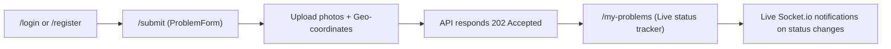
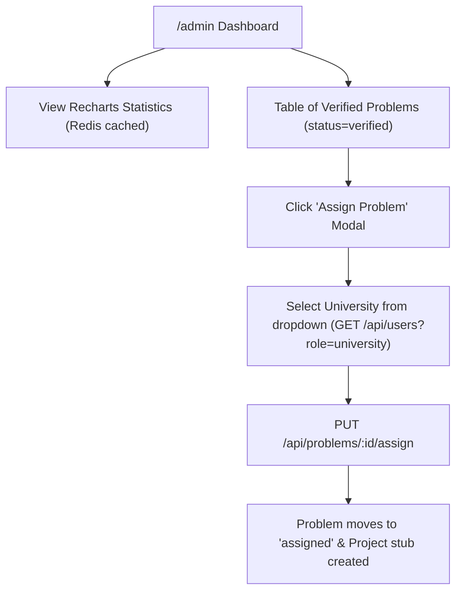
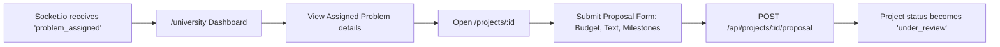
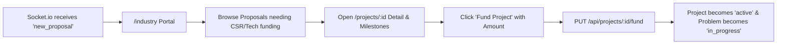

# 🌐 Frontend Architecture & Implementation Plan (SIH 2026)

Based on the **Societal Innovation Portal Specification (Revision 2.0)** and the active backend API contracts.

---

## 🗺️ 1. Master Route Map: Frontend Page ↔ Backend API

| Frontend URL | Component / Page | Access Control (RBAC) | Backend API Endpoint(s) Triggered | Purpose / User Action |
| :--- | :--- | :--- | :--- | :--- |
| `/` | `Home.tsx` | Public | None (or `GET /api/problems?limit=6`) | Landing page, platform stats summary, hero CTA |
| `/login` | `Login.tsx` | Public (guest only) | `POST /api/auth/login` | Authenticate user, store JWT token + role in Zustand |
| `/register` | `Register.tsx` | Public (guest only) | `POST /api/auth/register` | Signup as Citizen, University, or Industry |
| `/problems` | `ProblemList.tsx` | Authenticated | `GET /api/problems?category=&district=&status=` | Explore reported civic issues with filters + map view |
| `/problems/:id` | `ProblemDetail.tsx` | Authenticated | `GET /api/problems/:id` | View problem details, photos, geolocation, AI priority, and status |
| `/submit` | `SubmitProblem.tsx` | Citizen only | `POST /api/problems` (multipart/form-data) | File report with photos, location (lat, lng, district), description |
| `/my-problems` | `MyProblems.tsx` | Citizen only | `GET /api/problems?submitted_by=me` | Citizen tracks progress of their own reported problems |
| `/admin` | `AdminDashboard.tsx` | Admin only | `GET /api/problems/stats/dashboard`<br>`GET /api/problems?status=verified`<br>`GET /api/users?role=university`<br>`PUT /api/problems/:id/assign` | Review stats, view AI-verified problems, assign to universities |
| `/university` | `UniversityDashboard.tsx` | University only | `GET /api/projects?university_id=me` | View assigned problems waiting for proposals |
| `/industry` | `IndustryPortal.tsx` | Industry only | `GET /api/projects?status=under_review` | Browse project proposals needing corporate/CSR funding |
| `/projects/:id` | `ProjectDetail.tsx` | University, Industry, Admin | `GET /api/projects/:id`<br>`POST /api/projects/:id/proposal` (Uni)<br>`PUT /api/projects/:id/fund` (Ind) | Submit milestone-based proposal OR fund an active proposal |

---

## 👥 2. Role-Based User Workflows & Navigation Paths

### 1. Citizen Workflow (`role: "citizen"`)

- **Page `/submit`**:
  - Drag-and-drop image upload (Cloudinary).
  - Geolocation picker (auto-detect GPS or map pin selector).
  - Title, description, and district selection.
- **Page `/my-problems`**:
  - Timeline tracker: `Submitted` ➔ `AI Verified` ➔ `Assigned` ➔ `In Progress` ➔ `Resolved`.

---

### 2. Admin Workflow (`role: "admin"`)


---

### 3. University Workflow (`role: "university"`)


---

### 4. Industry Workflow (`role: "industry"`)


---

## ⚡ 3. Real-Time Socket.io Event Subscriptions

Frontend listens to real-time events via `useSocket.ts` hook:

| Event Name | Sent to Room | Who Listens on Frontend | Frontend Action Triggered |
| :--- | :--- | :--- | :--- |
| `problem_verified` | `admins` | Admin Dashboard | Automatically updates verified problem count and prepends new problem to review table |
| `problem_assigned` | `university_{id}` | University Dashboard | Plays sound/toast notification: *"New problem assigned to your lab"*, refreshes dashboard |
| `new_proposal` | `industry` | Industry Portal | Banner alert: *"New proposal available for funding"*, appends to fundable list |
| `project_funded` | `university_{id}` | University & Citizen | Toast: *"Your project was funded! Begin work"*, updates timeline to `in_progress` |
| `project_active` | `admins` | Admin Dashboard | Updates total platform funding counters |

---

## 🏗️ 4. Frontend Architecture & Folder Structure

```
apps/web/src/
├── api/
│   ├── client.ts                 # Axios instance with Bearer token interceptor
│   ├── auth.api.ts               # login, register, getMe
│   ├── problems.api.ts           # submitProblem, listProblems, getProblemById, assignProblem
│   ├── projects.api.ts           # listProjects, getProjectById, submitProposal, fundProject
│   ├── users.api.ts              # getUsers(role)
│   └── notifications.api.ts      # getNotifications, markAsRead
│
├── components/
│   ├── Layout.tsx                # Navbar (with unread notification bell) + Footer
│   ├── ProtectedRoute.tsx        # Role-based route gate using Zustand store
│   ├── forms/
│   │   ├── ProblemForm.tsx       # Photo upload + Leaflet/Mapbox location picker
│   │   └── ProposalForm.tsx      # Budget + dynamic milestone creator
│   ├── dashboard/
│   │   ├── StatsCard.tsx         # Numeric metric card with trend icon
│   │   └── CategoryChart.tsx     # Recharts bar/pie chart for problem categories
│   ├── ui/
│   │   ├── Button.tsx, Input.tsx, Modal.tsx, Badge.tsx, Dropdown.tsx
│   └── notifications/
│       └── NotificationDropdown.tsx # Real-time unread notifications panel
│
├── hooks/
│   ├── useAuth.ts                # Login, logout, current role helper
│   ├── useSocket.ts              # Socket.io connection, room auto-join, and event listener
│   └── useProblems.ts            # Fetch problems with search/filter state
│
├── store/
│   ├── auth.store.ts             # user: { id, name, role }, token, isAuthenticated
│   └── notification.store.ts     # unreadCount, notifications list
│
├── pages/
│   ├── Home.tsx
│   ├── Login.tsx
│   ├── Register.tsx
│   ├── ProblemList.tsx
│   ├── ProblemDetail.tsx
│   ├── SubmitProblem.tsx
│   ├── MyProblems.tsx
│   ├── AdminDashboard.tsx
│   ├── UniversityDashboard.tsx
│   ├── IndustryPortal.tsx
│   └── ProjectDetail.tsx
│
└── App.tsx                       # Master Route definitions
```

---

## 📦 5. Step-by-Step Implementation Sequence

1. **State & API Client**:
   - Verify `auth.store.ts` handles persistent storage (`localStorage`) of token and user object.
   - Configure `api/client.ts` with `baseURL: import.meta.env.VITE_API_URL` and automatic `Authorization: Bearer <token>` injection.
2. **Citizen Submission Flow**:
   - Connect `SubmitProblem.tsx` with `POST /api/problems` using `FormData` for multipart image uploads.
   - Implement `MyProblems.tsx` using `GET /api/problems?submitted_by=me`.
3. **Admin Dashboard Flow**:
   - Hook `AdminDashboard.tsx` to `GET /api/problems/stats/dashboard`.
   - Populate university assignment dropdown via `GET /api/users?role=university`.
   - Wire `PUT /api/problems/:id/assign`.
4. **University & Industry Collaboration Flow**:
   - `UniversityDashboard.tsx`: Display assigned problems waiting for proposals.
   - `ProjectDetail.tsx`: Proposal submission form (`POST /api/projects/:id/proposal`) and Funding modal (`PUT /api/projects/:id/fund`).
5. **Real-time Wiring**:
   - Hook `useSocket.ts` to `io(BACKEND_URL, { auth: { token } })`.
   - Wire notification bell in `Layout.tsx` to update instantly on socket events.
